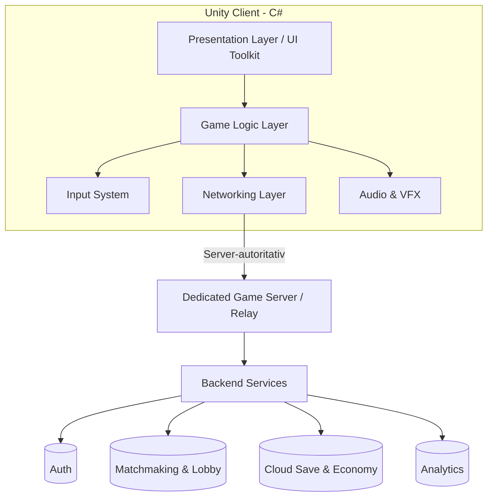

# Anforderungsspezifikation – Paintball-Spiel

> **Projektname:** Paint-Ball Game
> **Dokumentversion:** 1.0
> **Datum:** 14.09.2026
> **Status:** Entwurf
> **Technologie:** Unity (LTS) mit C#
> **Zielplattformen:** Mobile (Android/iOS), Desktop (Windows/macOS/Linux), Web (WebGL)

---

## Inhaltsverzeichnis

1. [Einführung](#1-einführung)
2. [Projektziele](#2-projektziele)
3. [Zielgruppe](#3-zielgruppe)
4. [Zielplattformen & Kompatibilität](#4-zielplattformen--kompatibilität)
5. [Technologie-Stack](#5-technologie-stack)
6. [Funktionale Anforderungen](#6-funktionale-anforderungen)
7. [UI/UX-Anforderungen](#7-uiux-anforderungen)
8. [Nicht-funktionale Anforderungen](#8-nicht-funktionale-anforderungen)
9. [Technische Architektur](#9-technische-architektur)
10. [Monetarisierung](#10-monetarisierung)
11. [Teststrategie & Qualitätssicherung](#11-teststrategie--qualitätssicherung)
12. [Projektphasen & Roadmap](#12-projektphasen--roadmap)
13. [Risiken & Annahmen](#13-risiken--annahmen)
14. [Glossar](#14-glossar)

---

## 1. Einführung

### 1.1 Zweck des Dokuments
Dieses Dokument beschreibt die vollständigen funktionalen und nicht-funktionalen Anforderungen für die Entwicklung eines plattformübergreifenden Paintball-Spiels. Es dient als verbindliche Grundlage für Design, Entwicklung, Test und Abnahme.

### 1.2 Produktvision
Ein schnelles, actiongeladenes und zugängliches Paintball-Multiplayer-Spiel, das auf Mobilgeräten, Desktop und im Web mit **identischem Spielspaß** und einer **erstklassigen, intuitiven Benutzeroberfläche** gespielt werden kann. Der Fokus liegt auf fairem Wettbewerb, farbenfroher Präsentation und geringer Einstiegshürde bei gleichzeitig hohem Skill-Ceiling.

### 1.3 Umfang (Scope)
- Einzelspieler-Modus (Training, Bot-Matches, Kampagne)
- Echtzeit-Multiplayer (PvP)
- Anpassbare Spielercharaktere und Paintball-Marker (Waffen)
- Mehrere Spielmodi und Karten
- Fortschritts- und Belohnungssystem
- Plattformübergreifendes Matchmaking (Cross-Play)

---

## 2. Projektziele

| ID | Ziel | Beschreibung |
|----|------|--------------|
| Z-01 | Plattformübergreifend | Ein Code-Base für Mobile, Desktop und Web mit Unity. |
| Z-02 | Exzellente UI/UX | Intuitive, reaktionsschnelle und ästhetisch ansprechende Oberfläche auf allen Geräten. |
| Z-03 | Faires Gameplay | Ausgewogene Spielmechanik ohne Pay-to-Win. |
| Z-04 | Geringe Einstiegshürde | In < 60 Sekunden vom Start ins erste Match. |
| Z-05 | Performance | Flüssige 60 FPS auf Mid-Range-Geräten. |
| Z-06 | Skalierbarkeit | Unterstützung wachsender Spielerzahlen ohne Qualitätsverlust. |
| Z-07 | Wiederspielwert | Progression, Events und Anpassung fördern langfristige Bindung. |

---

## 3. Zielgruppe

- **Primär:** Gelegenheits- und Kernspieler im Alter von 12–35 Jahren, die schnelle Multiplayer-Action mögen.
- **Sekundär:** E-Sport-interessierte Spieler, die kompetitive Ranglisten suchen.
- **Geräteprofil:** Von Einsteiger-Smartphones bis zu High-End-Gaming-PCs.
- **Freigabe (Alterseinstufung):** Angestrebt PEGI 7 / ESRB E (Everyone) – comichafte, unblutige Farbdarstellung statt realistischer Gewalt.

---

## 4. Zielplattformen & Kompatibilität

| ID | Plattform | Mindestanforderung | Build-Target |
|----|-----------|--------------------|--------------|
| P-01 | Android | Android 8.0+ (API 26), 2 GB RAM | IL2CPP, ARM64 |
| P-02 | iOS | iOS 13+, iPhone 8 oder neuer | IL2CPP, ARM64 |
| P-03 | Windows | Windows 10 64-bit | Mono/IL2CPP |
| P-04 | macOS | macOS 11 Big Sur+ | IL2CPP (Universal) |
| P-05 | Linux | Ubuntu 20.04+ | IL2CPP |
| P-06 | Web | Aktuelle Chrome/Firefox/Edge/Safari (WebGL 2.0) | Unity WebGL |

### 4.1 Plattformspezifische Anforderungen
- **PA-01:** Steuerung muss sich automatisch an das Eingabegerät anpassen (Touch, Maus/Tastatur, Gamepad).
- **PA-02:** UI-Layout muss responsiv sein und sich an Bildschirmgröße, Seitenverhältnis (16:9, 20:9, 4:3) und Ausrichtung anpassen.
- **PA-03:** Web-Build muss unter 50 MB initiale Ladezeit optimiert sein (Streaming/Komprimierung, Brotli).
- **PA-04:** Mobile-Builds müssen Akkuverbrauch und thermisches Verhalten optimieren (FPS-Cap-Option).
- **PA-05:** Cross-Play zwischen allen Plattformen soll optional aktivierbar/deaktivierbar sein (Fairness Touch vs. Maus).

---

## 5. Technologie-Stack

| Bereich | Technologie |
|---------|-------------|
| Engine | Unity 2022 LTS oder neuer |
| Programmiersprache | C# |
| Rendering | Universal Render Pipeline (URP) für plattformübergreifende Performance |
| UI-System | Unity UI Toolkit (bevorzugt) und/oder uGUI |
| Netzwerk/Multiplayer | Unity Netcode for GameObjects oder Photon Fusion / PUN |
| Backend-Dienste | Unity Gaming Services (Authentication, Lobby, Matchmaking, Cloud Save, Economy) |
| Analytics | Unity Analytics oder GameAnalytics |
| Eingabe | Unity Input System (New) |
| Lokalisierung | Unity Localization Package |
| Versionsverwaltung | Git |
| CI/CD | Unity Cloud Build / GitHub Actions |

---

## 6. Funktionale Anforderungen

### 6.1 Kern-Gameplay

| ID | Anforderung | Priorität |
|----|-------------|-----------|
| FR-01 | Der Spieler steuert einen Charakter aus der Third-Person- oder Top-Down-Perspektive (final zu bestimmen im Prototyp). | Muss |
| FR-02 | Der Spieler kann sich bewegen (laufen, sprinten, ducken, springen) und die Kamera drehen. | Muss |
| FR-03 | Der Spieler feuert Paintballs ab, die einer ballistischen Flugbahn folgen (Projektilphysik mit Schwerkraft). | Muss |
| FR-04 | Treffer hinterlassen sichtbare Farbkleckse auf Spielern und Umgebung (Decals). | Muss |
| FR-05 | Jeder Spieler besitzt eine Trefferanzeige/Trefferzone; nach X Treffern gilt der Spieler als "markiert"/ausgeschieden. | Muss |
| FR-06 | Munition ist begrenzt und muss über Nachladen und/oder Nachschubstationen aufgefüllt werden. | Muss |
| FR-07 | Der Spieler kann hinter Deckung in Deckung gehen (Cover-System). | Soll |
| FR-08 | Nachlade-Mechanik mit Animation und Zeitkosten. | Muss |
| FR-09 | Power-Ups auf der Karte (Schnellfeuer, Schild, Geschwindigkeit, Munition). | Soll |
| FR-10 | Trefferfeedback: visuelles (Farbe, Bildschirmeffekt) und haptisches (Vibration auf Mobile/Gamepad) Feedback. | Muss |

### 6.2 Spielmodi

| ID | Modus | Beschreibung | Priorität |
|----|-------|--------------|-----------|
| FR-11 | **Deathmatch (Frei für alle)** | Jeder gegen jeden, meiste Treffer gewinnt. | Muss |
| FR-12 | **Team-Deathmatch** | Zwei Teams treten gegeneinander an. | Muss |
| FR-13 | **Capture the Flag** | Fahne des Gegners erobern und zur Basis bringen. | Soll |
| FR-14 | **Last Player Standing (Elimination)** | Kein Respawn, letzter Überlebender gewinnt. | Soll |
| FR-15 | **King of the Hill / Zonenkontrolle** | Zone halten, um Punkte zu sammeln. | Kann |
| FR-16 | **Trainingsmodus** | Übung gegen Bots ohne Wertung. | Muss |
| FR-17 | **Kampagne / Einzelspieler** | Aufeinanderfolgende Missionen gegen KI mit Story-Elementen. | Kann |
| FR-18 | **Privates Match** | Match mit Freunden über Einladungscode/Lobby. | Soll |

### 6.3 Multiplayer & Netzwerk

| ID | Anforderung | Priorität |
|----|-------------|-----------|
| FR-19 | Echtzeit-Multiplayer für mind. 8 (Ziel: bis 16) Spieler pro Match. | Muss |
| FR-20 | Automatisches Matchmaking basierend auf Skill/Rang (MMR). | Soll |
| FR-21 | Lobby-System mit Team-Auswahl und Bereitschaftsstatus. | Muss |
| FR-22 | Server-autoritative Architektur zur Cheat-Vermeidung. | Muss |
| FR-23 | Client-seitige Vorhersage (Prediction) und Interpolation für flüssiges Spielgefühl. | Muss |
| FR-24 | Reconnect-Funktion bei kurzzeitigem Verbindungsverlust. | Soll |
| FR-25 | Optionales Cross-Play mit Ein-/Ausschalter. | Soll |
| FR-26 | Anzeige von Ping/Latenz und Serverregion-Auswahl. | Soll |

### 6.4 Charakter- & Ausrüstungsanpassung

| ID | Anforderung | Priorität |
|----|-------------|-----------|
| FR-27 | Auswahl und Anpassung des Spielercharakters (Skins, Outfits, Farben). | Soll |
| FR-28 | Verschiedene Paintball-Marker (Waffen) mit unterschiedlichen Werten (Feuerrate, Schaden, Reichweite, Genauigkeit, Munitionskapazität). | Muss |
| FR-29 | Ausrüstungs-Slots (Marker, Ausweichgadget, Verbrauchsgegenstand). | Soll |
| FR-30 | Individualisierung der Paintball-Farbe pro Spieler/Team. | Kann |
| FR-31 | Vorschau der Anpassungen in einem 3D-Charakter-Viewer. | Soll |

### 6.5 Progression & Belohnung

| ID | Anforderung | Priorität |
|----|-------------|-----------|
| FR-32 | Erfahrungspunkte (XP) und Levelaufstieg pro Match. | Muss |
| FR-33 | Freischaltung von Ausrüstung/Skins durch Fortschritt (nicht rein zahlungsbasiert). | Muss |
| FR-34 | Tägliche/wöchentliche Herausforderungen (Quests). | Soll |
| FR-35 | Ranglistensystem (Ligen/Divisionen) mit Saisons. | Soll |
| FR-36 | Statistiken pro Spieler (Treffer, Genauigkeit, Siege, K/D). | Soll |
| FR-37 | Errungenschaften/Achievements. | Kann |
| FR-38 | Bestenlisten (global, freundschaftsbasiert, regional). | Soll |

### 6.6 Konto & Soziales

| ID | Anforderung | Priorität |
|----|-------------|-----------|
| FR-39 | Anmeldung via Gast, E-Mail, Google, Apple, Steam. | Muss |
| FR-40 | Plattformübergreifende Fortschrittssynchronisation (Cloud Save). | Soll |
| FR-41 | Freundesliste und Einladungen. | Soll |
| FR-42 | In-Match-Kommunikation via Quick-Chat/Emotes (kein offener Text-Chat für Jugendschutz, moderierbar). | Soll |
| FR-43 | Melde- und Blockierfunktion für Fehlverhalten. | Soll |

### 6.7 Karten & Level

| ID | Anforderung | Priorität |
|----|-------------|-----------|
| FR-44 | Mindestens 3 abwechslungsreiche Karten zum Launch (z. B. Lagerhaus, Wald, Arena). | Muss |
| FR-45 | Karten enthalten Deckung, Hindernisse, Nachschubpunkte und Spawn-Zonen. | Muss |
| FR-46 | Balancierte, symmetrische und asymmetrische Kartendesigns. | Soll |
| FR-47 | Dynamische Elemente (bewegliche Deckung, interaktive Objekte). | Kann |

---

## 7. UI/UX-Anforderungen

> **Kernziel Z-02:** Die Benutzeroberfläche muss auf allen Plattformen erstklassig, konsistent, reaktionsschnell und barrierearm sein.

### 7.1 Design-Prinzipien

| ID | Prinzip | Beschreibung |
|----|---------|--------------|
| UX-01 | Klarheit | Jeder Bildschirm hat ein klares Ziel; keine Überladung. |
| UX-02 | Konsistenz | Einheitliche Farb-, Typografie- und Komponentensprache (Design-System). |
| UX-03 | Reaktionsschnelligkeit | UI-Interaktionen reagieren in < 100 ms mit visuellem Feedback. |
| UX-04 | Zugänglichkeit | Skalierbare Schrift, Farbenblind-Modi, Untertitel, große Touch-Ziele (≥ 44 px). |
| UX-05 | Responsivität | Adaptive Layouts für Handy, Tablet, Desktop und Web. |
| UX-06 | Feedback | Klare visuelle/akustische/haptische Rückmeldung für jede Aktion. |
| UX-07 | Wiedererkennbarkeit | Ikonografie und Metaphern sind intuitiv und selbsterklärend. |

### 7.2 Erforderliche Bildschirme (Screens)

| ID | Bildschirm | Inhalt |
|----|-----------|--------|
| UI-01 | Splash & Ladebildschirm | Logo, Ladefortschritt, Tipps. |
| UI-02 | Hauptmenü | Spielen, Anpassen, Shop, Einstellungen, Profil, sozial. |
| UI-03 | Modusauswahl | Spielmodi mit Vorschau und Kurzbeschreibung. |
| UI-04 | Lobby/Matchmaking | Spielerliste, Team, Bereitschaft, Countdown, Ping. |
| UI-05 | In-Game HUD | Munition, Trefferanzeige, Minimap, Punktestand, Timer, Fadenkreuz. |
| UI-06 | Pause-Menü | Fortsetzen, Einstellungen, Verlassen. |
| UI-07 | Ergebnisbildschirm | Ranking, XP-Gewinn, Statistiken, Belohnungen. |
| UI-08 | Anpassung/Loadout | Charakter, Marker, Skins, 3D-Vorschau. |
| UI-09 | Shop | Kosmetik, Battle Pass, Währungen (transparent, kein Pay-to-Win). |
| UI-10 | Profil & Statistiken | Level, Rang, Erfolge, Historie. |
| UI-11 | Einstellungen | Grafik, Audio, Steuerung, Sprache, Barrierefreiheit, Konto. |
| UI-12 | Onboarding/Tutorial | Interaktive Einführung für neue Spieler. |

### 7.3 Steuerung & Eingabe

| ID | Anforderung | Priorität |
|----|-------------|-----------|
| UX-08 | **Mobile:** Virtueller Joystick (Bewegung) + Feuer-/Aktionsbuttons, optional Gyro-Zielen, anpassbares Layout. | Muss |
| UX-09 | **Desktop:** Maus + Tastatur (WASD), voll belegbare Tastenbelegung. | Muss |
| UX-10 | **Gamepad:** Volle Controller-Unterstützung (Xbox/PS/generisch) auf allen Plattformen. | Soll |
| UX-11 | Automatische Erkennung und Umschaltung des aktiven Eingabegeräts. | Muss |
| UX-12 | Empfindlichkeits-, Invertierungs- und Aim-Assist-Optionen. | Soll |
| UX-13 | Haptisches Feedback (Vibration) für Treffer und Aktionen. | Soll |

### 7.4 Visuelles Design

| ID | Anforderung |
|----|-------------|
| UX-14 | Farbenfroher, comichaft-stilisierter Look mit hohem Kontrast zwischen Team-Farben. |
| UX-15 | Konsistentes Design-System (Farbpalette, Typografie, Abstände, Komponenten, Icons). |
| UX-16 | Weiche, sinnvolle Animationen und Übergänge (Micro-Interactions) ohne Ablenkung. |
| UX-17 | Klare Lesbarkeit des HUD auch bei kleinen Bildschirmen und hohem Bewegungstempo. |
| UX-18 | Dunkel-/Hell-Modus für Menüs (optional). |

### 7.5 Barrierefreiheit (Accessibility)

| ID | Anforderung |
|----|-------------|
| UX-19 | Farbenblind-freundliche Team-Kennzeichnung (Formen/Symbole zusätzlich zu Farbe). |
| UX-20 | Skalierbare UI- und Textgrößen. |
| UX-21 | Untertitel und visuelle Hinweise für wichtige Audio-Events. |
| UX-22 | Reduzierte-Bewegung-Option und Kameraschüttel-Deaktivierung. |
| UX-23 | Vollständige Neubelegbarkeit der Steuerung. |

### 7.6 Lokalisierung

| ID | Anforderung |
|----|-------------|
| UX-24 | Mehrsprachige Unterstützung (mind. Deutsch, Englisch; erweiterbar). |
| UX-25 | Texte, Datums-/Zahlenformate und UI-Layout an Sprache anpassbar. |

---

## 8. Nicht-funktionale Anforderungen

### 8.1 Performance

| ID | Anforderung |
|----|-------------|
| NFR-01 | Ziel 60 FPS auf Mid-Range-Geräten, mind. stabile 30 FPS auf Einsteigergeräten. |
| NFR-02 | Ladezeit ins Match < 10 Sekunden (Desktop/Mobile), Web-Start < 15 Sekunden. |
| NFR-03 | Netzwerklatenz-Toleranz bis 150 ms ohne spürbaren Spielfluss-Verlust. |
| NFR-04 | Speicherverbrauch Mobile < 1,5 GB RAM zur Laufzeit. |

### 8.2 Zuverlässigkeit & Verfügbarkeit

| ID | Anforderung |
|----|-------------|
| NFR-05 | Backend-Verfügbarkeit ≥ 99,5 %. |
| NFR-06 | Graceful Degradation bei Serverproblemen (Fehlermeldungen, Retry). |
| NFR-07 | Absturzrate < 1 % der Sitzungen. |

### 8.3 Sicherheit & Fairness

| ID | Anforderung |
|----|-------------|
| NFR-08 | Server-autoritative Spiellogik gegen Cheating. |
| NFR-09 | Verschlüsselte Kommunikation (TLS) und sichere Authentifizierung. |
| NFR-10 | Schutz personenbezogener Daten gemäß DSGVO. |
| NFR-11 | Anti-Cheat-Maßnahmen und serverseitige Validierung von Aktionen. |
| NFR-12 | Kein Pay-to-Win: Käufe wirken sich nicht auf Spielbalance aus (nur Kosmetik/Komfort). |

### 8.4 Skalierbarkeit & Wartbarkeit

| ID | Anforderung |
|----|-------------|
| NFR-13 | Modulare, erweiterbare Code-Architektur (klare Trennung von Gameplay, UI, Netzwerk, Daten). |
| NFR-14 | Konfigurierbare Spielparameter über Daten (ScriptableObjects/Remote Config) ohne Neu-Build. |
| NFR-15 | Automatisierte Builds und Tests via CI/CD. |
| NFR-16 | Code-Standards, Dokumentation und Code-Reviews verpflichtend. |

### 8.5 Usability

| ID | Anforderung |
|----|-------------|
| NFR-17 | Neuer Spieler erreicht sein erstes Match in < 60 Sekunden. |
| NFR-18 | Menü-Navigation in maximal 3 Ebenen erreichbar. |
| NFR-19 | Konsistente Bedienung über alle Plattformen hinweg. |

---

## 9. Technische Architektur

### 9.1 Übersicht

### 9.2 Architekturprinzipien

| ID | Anforderung |
|----|-------------|
| AR-01 | Klare Schichtentrennung: Präsentation, Spiellogik, Netzwerk, Daten. |
| AR-02 | Wiederverwendbare, entkoppelte Komponenten (Component-based / SOLID). |
| AR-03 | Datengetriebene Konfiguration über ScriptableObjects. |
| AR-04 | Ein gemeinsamer Code-Base für alle Plattformen mit plattformspezifischen Adaptern. |
| AR-05 | Abstraktion der Eingabe, damit Touch/Maus/Gamepad austauschbar sind. |
| AR-06 | Server-autoritatives Netzwerkmodell mit Client-Prediction. |

---

## 10. Monetarisierung

> Optional, aber von Beginn an fair und transparent zu gestalten.

| ID | Anforderung |
|----|-------------|
| M-01 | Free-to-Play als Basismodell. |
| M-02 | Kosmetische Mikrotransaktionen (Skins, Emotes, Paintball-Farben). |
| M-03 | Optionaler Battle Pass mit kosmetischen und Komfort-Belohnungen. |
| M-04 | Keine spielentscheidenden Vorteile durch Käufe (kein Pay-to-Win). |
| M-05 | Optionale, nicht aufdringliche Werbung (z. B. belohnte Videos) nur auf Mobile. |
| M-06 | Transparente Preis- und Wahrscheinlichkeitsangaben (bei Lootboxen ggf. gesetzeskonform). |

---

## 11. Teststrategie & Qualitätssicherung

| ID | Anforderung |
|----|-------------|
| QA-01 | Unit-Tests für Kern-Spiellogik (C#, Unity Test Framework). |
| QA-02 | Integrationstests für Netzwerk- und Backend-Anbindung. |
| QA-03 | Play-Tests auf realen Zielgeräten pro Plattform. |
| QA-04 | Performance-Profiling (Unity Profiler, Frame Debugger) je Plattform. |
| QA-05 | Usability-Tests der UI/UX mit echten Nutzern. |
| QA-06 | Automatisierte Builds und Smoke-Tests via CI/CD. |
| QA-07 | Beta-Phase (geschlossen/offen) vor Launch. |
| QA-08 | Cross-Play- und Eingabegerät-Kompatibilitätstests. |

---

## 12. Projektphasen & Roadmap

| Phase | Ziel | Wesentliche Ergebnisse |
|-------|------|------------------------|
| **P0 – Konzept** | Vision & Design | Game Design Document, Wireframes, Tech-Spike. |
| **P1 – Prototyp** | Kern-Gameplay | Bewegung, Schießen, Treffer, eine Karte, ein Modus (lokal). |
| **P2 – Vertical Slice** | Spielbares Vertikal-Segment | Multiplayer, HUD, ein vollständiger Modus, UI-Grundgerüst. |
| **P3 – Alpha** | Feature-vollständig | Alle Kernmodi, Progression, Anpassung, Backend-Anbindung. |
| **P4 – Beta** | Stabilisierung | Balancing, Optimierung, Bugfixing, Play-Tests, Barrierefreiheit. |
| **P5 – Launch** | Veröffentlichung | Store-Releases (Android/iOS), Desktop-Distribution, Web-Deployment. |
| **P6 – Live-Ops** | Betrieb & Wachstum | Saisons, Events, neue Karten/Modi, Updates. |

---

## 13. Risiken & Annahmen

### 13.1 Risiken

| ID | Risiko | Gegenmaßnahme |
|----|--------|---------------|
| R-01 | Performance auf WebGL/schwachen Mobilgeräten | Frühe Performance-Budgets, URP-Optimierung, LOD, Asset-Streaming. |
| R-02 | Netzwerk-Latenz & Fairness | Server-Prediction, Regionsserver, Lag-Kompensation. |
| R-03 | Cross-Play-Balance (Touch vs. Maus) | Optionale Trennung, Aim-Assist-Anpassung. |
| R-04 | Cheating im Multiplayer | Server-Autorität, Anti-Cheat, Validierung. |
| R-05 | UI-Konsistenz über sehr unterschiedliche Bildschirmgrößen | Responsives Design-System, frühe Geräte-Tests. |
| R-06 | Umfang zu groß (Scope Creep) | Priorisierung (Muss/Soll/Kann), iterative Phasen. |

### 13.2 Annahmen

- Unity LTS und die genannten Gaming Services bleiben verfügbar und kompatibel.
- Ein Backend-Dienst für Multiplayer/Matchmaking steht zur Verfügung.
- Die Zielgeräte erfüllen die in Abschnitt 4 genannten Mindestanforderungen.

---

## 14. Glossar

| Begriff | Bedeutung |
|---------|-----------|
| **Marker** | Paintball-Waffe / Abschussgerät. |
| **HUD** | Head-Up-Display; die spielinterne Informationsanzeige. |
| **MMR** | Matchmaking Rating; Bewertung der Spielstärke. |
| **URP** | Universal Render Pipeline von Unity. |
| **Server-autoritativ** | Der Server entscheidet verbindlich über den Spielzustand. |
| **Client-Prediction** | Vorhersage von Aktionen auf dem Client für flüssiges Spielgefühl. |
| **Decal** | Aufgeprojizierte Textur (z. B. Farbklecks) auf Oberflächen. |
| **Loadout** | Ausrüstungszusammenstellung eines Spielers. |
| **Cross-Play** | Plattformübergreifendes gemeinsames Spielen. |
| **Live-Ops** | Laufender Betrieb mit Events und Updates nach dem Launch. |

---

### Priorisierungslegende
- **Muss:** Zwingend erforderlich für den Launch (MVP).
- **Soll:** Wichtig, aber nach dem MVP umsetzbar.
- **Kann:** Wünschenswert, optional / spätere Iteration.

---

*Ende des Dokuments – Version 1.0*
