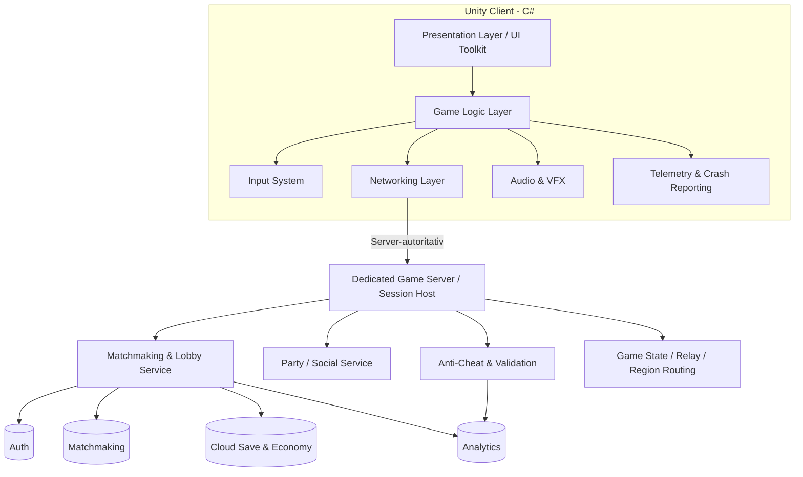

# Anforderungsspezifikation – Paintball-Spiel

> **Projektname:** Paint-Ball Game
> **Dokumentversion:** 1.0
> **Datum:** 14.09.2026
> **Status:** Entwurf
> **Technologie:** Unity (LTS) mit C#
> **Zielplattformen:** Mobile (Android/iOS), Desktop (Windows/macOS/Linux), Web (WebGL)

---

## Inhaltsverzeichnis

1. [Einführung](#1-einführung)
2. [Projektziele](#2-projektziele)
3. [Zielgruppe](#3-zielgruppe)
4. [Zielplattformen & Kompatibilität](#4-zielplattformen--kompatibilität)
5. [Technologie-Stack](#5-technologie-stack)
6. [Funktionale Anforderungen](#6-funktionale-anforderungen)
7. [UI/UX-Anforderungen](#7-uiux-anforderungen)
8. [Nicht-funktionale Anforderungen](#8-nicht-funktionale-anforderungen)
9. [Technische Architektur](#9-technische-architektur)
10. [Monetarisierung](#10-monetarisierung)
11. [Teststrategie & Qualitätssicherung](#11-teststrategie--qualitätssicherung)
12. [Projektphasen & Roadmap](#12-projektphasen--roadmap)
13. [Risiken & Annahmen](#13-risiken--annahmen)
14. [Glossar](#14-glossar)

---

## 1. Einführung

### 1.1 Zweck des Dokuments
Dieses Dokument definiert die funktionalen, technischen und qualitativen Anforderungen für ein plattformübergreifendes Paintball-Multiplayer-Spiel mit Live-Betrieb. Es ist die verbindliche Grundlage für Konzept, Architektur, Entwicklung, Test, Balancing und Abnahme.

### 1.2 Produktvision
Ein schnelles, kompetitives und leicht zugängliches Online-Paintball-Spiel mit kurzen Match-Zyklen, klarer Teamorientierung und hoher Wiederspielbarkeit. Das Spiel soll auf Mobilgeräten, Desktop und im Web einen konsistenten Multiplayer-Kern bieten: sofortiges Einsteigen, stabiles Matchmaking, saubere Server-Synchronisation und ein fairer Wettbewerb ohne Pay-to-Win.

### 1.3 Umfang (Scope)
- Echtzeit-Multiplayer als Kern des Produkts
- Matchmaking, Lobby, Party- und Einladungsfluss
- Server-autoritative PvP-Matches mit Reconnect-Unterstützung
- Anpassbare Spielercharaktere, Marker und Loadouts
- Mehrere kompetitive Spielmodi und abwechslungsreiche Karten
- Progressions-, Ranglisten- und Live-Ops-Systeme
- Plattformübergreifendes Spielen mit optionalem Cross-Play

---

## 2. Projektziele

| ID | Ziel | Beschreibung |
|----|------|--------------|
| Z-01 | Plattformübergreifend | Ein gemeinsamer Unity-Code-Base für Mobile, Desktop und Web mit identischem Multiplayer-Kern. |
| Z-02 | Sofort spielbar | In unter 60 Sekunden vom Start in eine Lobby oder direkt in ein Match gelangen. |
| Z-03 | Stabiles Multiplayer-Erlebnis | Sichere Synchronisation, geringe Latenz, flüssige Bewegung und robuste Reconnect-Mechanik. |
| Z-04 | Faires Gameplay | Ausgewogene, server-seitig validierte Spielmechanik ohne Pay-to-Win. |
| Z-05 | Skalierbarkeit | Stabiler Betrieb bei wachsender Spielerzahl, mehreren Regionen und saisonalen Peaks. |
| Z-06 | Exzellente UI/UX | Intuitive, reaktionsschnelle und gut lesbare Oberfläche auf allen Geräten. |
| Z-07 | Wiederspielwert | Ranglisten, Progression, Saisons, Events und kosmetische Anpassung fördern langfristige Bindung. |
| Z-08 | Betriebssicherheit | Matchmaking, Authentifizierung und Backend-Dienste müssen im Live-Betrieb zuverlässig funktionieren. |

---

## 3. Zielgruppe

- **Primär:** Gelegenheits- und Kernspieler im Alter von 12–35 Jahren, die schnelle Multiplayer-Action mögen.
- **Sekundär:** E-Sport-interessierte Spieler, die kompetitive Ranglisten suchen.
- **Geräteprofil:** Von Einsteiger-Smartphones bis zu High-End-Gaming-PCs.
- **Freigabe (Alterseinstufung):** Angestrebt PEGI 7 / ESRB E (Everyone) – comichafte, unblutige Farbdarstellung statt realistischer Gewalt.

---

## 4. Zielplattformen & Kompatibilität

| ID | Plattform | Mindestanforderung | Build-Target |
|----|-----------|--------------------|--------------|
| P-01 | Android | Android 8.0+ (API 26), 2 GB RAM | IL2CPP, ARM64 |
| P-02 | iOS | iOS 13+, iPhone 8 oder neuer | IL2CPP, ARM64 |
| P-03 | Windows | Windows 10 64-bit | Mono/IL2CPP |
| P-04 | macOS | macOS 11 Big Sur+ | IL2CPP (Universal) |
| P-05 | Linux | Ubuntu 20.04+ | IL2CPP |
| P-06 | Web | Aktuelle Chrome/Firefox/Edge/Safari (WebGL 2.0) | Unity WebGL |

### 4.1 Plattformspezifische Anforderungen
- **PA-01:** Steuerung muss sich automatisch an das Eingabegerät anpassen (Touch, Maus/Tastatur, Gamepad).
- **PA-02:** UI-Layout muss responsiv sein und sich an Bildschirmgröße, Seitenverhältnis (16:9, 20:9, 4:3) und Ausrichtung anpassen.
- **PA-03:** Web-Build muss unter 50 MB initiale Ladezeit optimiert sein (Streaming/Komprimierung, Brotli).
- **PA-04:** Mobile-Builds müssen Akkuverbrauch und thermisches Verhalten optimieren (FPS-Cap-Option).
- **PA-05:** Cross-Play zwischen allen Plattformen soll optional aktivierbar/deaktivierbar sein (Fairness Touch vs. Maus).

---

## 5. Technologie-Stack

| Bereich | Technologie |
|---------|-------------|
| Engine | Unity 2022 LTS oder neuer |
| Programmiersprache | C# |
| Rendering | Universal Render Pipeline (URP) für plattformübergreifende Performance |
| UI-System | Unity UI Toolkit (bevorzugt) und/oder uGUI |
| Netzwerk/Multiplayer | Unity Netcode for GameObjects oder Photon Fusion / PUN |
| Backend-Dienste | Unity Gaming Services (Authentication, Lobby, Matchmaking, Cloud Save, Economy) |
| Analytics | Unity Analytics oder GameAnalytics |
| Eingabe | Unity Input System (New) |
| Lokalisierung | Unity Localization Package |
| Versionsverwaltung | Git |
| CI/CD | Unity Cloud Build / GitHub Actions |

---

## 6. Funktionale Anforderungen

### 6.1 Kern-Gameplay

| ID | Anforderung | Priorität |
|----|-------------|-----------|
| FR-01 | Der Spieler steuert einen Charakter in einer klar lesbaren Third-Person-Perspektive; die Kamera muss für Nahkampf, Deckung und Teamübersicht geeignet sein. | Muss |
| FR-02 | Der Spieler kann sich bewegen (laufen, sprinten, ducken, springen, in Deckung gehen) und die Kamera frei drehen. | Muss |
| FR-03 | Der Spieler feuert Paintballs ab, die einer ballistischen Flugbahn folgen; Reichweite, Streuung und Drop sollen taktisches Zielen fördern. | Muss |
| FR-04 | Treffer hinterlassen sichtbare Farbkleckse auf Spielern, Ausrüstung und Umgebung, damit Treffer auch aus Distanz erkennbar bleiben. | Muss |
| FR-05 | Jeder Spieler besitzt eine Trefferanzeige bzw. Trefferzonen-Logik; nach definierter Trefferzahl wird der Spieler ausgeschieden oder markiert. | Muss |
| FR-06 | Munition ist begrenzt, wird durch Nachladen aufgefüllt und kann über Feld- oder Basis-Nachschub stationen ergänzt werden. | Muss |
| FR-07 | Deckung muss spielerisch relevant sein, inklusive Peek-Verhalten, Deckungswechsel und klaren Sichtlinien. | Soll |
| FR-08 | Nachlade-Mechanik mit Animation, klarer Zeitkosten und unterbrechbaren Zuständen, soweit das Balancing es erlaubt. | Muss |
| FR-09 | Power-Ups auf der Karte (Schnellfeuer, Schild, Geschwindigkeit, Munition, Radar-Impuls) unterstützen taktische Entscheidungen. | Soll |
| FR-10 | Trefferfeedback muss visuell, akustisch und optional haptisch eindeutig sein; Team- und Selbsttreffer müssen unterscheidbar bleiben. | Muss |
| FR-11 | Das Movement muss netzwerkseitig sauber synchronisiert werden und darf bei hoher Latenz nicht unfaire Bewegungsfehler erzeugen. | Muss |
| FR-12 | Spawn-, Respawn- und Schutzlogik muss Exploits verhindern und Spawn-Kills reduzieren. | Muss |

### 6.2 Spielmodi

| ID | Modus | Beschreibung | Priorität |
|----|-------|--------------|-----------|
| FR-13 | **Schnelles Match** | Sofortiger Einstieg in ein passendes öffentliches Match mit automatischem Team- und Lobby-Fluss. | Muss |
| FR-14 | **Team-Deathmatch** | Zwei Teams treten gegeneinander an; Kernmodus für den Launch. | Muss |
| FR-15 | **Deathmatch (Frei für alle)** | Jeder gegen jeden, geeignet für kurze Sessions und Trainingsläufe. | Soll |
| FR-16 | **Capture the Flag** | Fahne des Gegners erobern und zur Basis bringen; Fokus auf Teamkoordination. | Soll |
| FR-17 | **Last Player Standing (Elimination)** | Kein Respawn, letzter Überlebender gewinnt; geeignet für kompetitive Runden. | Soll |
| FR-18 | **Zonenkontrolle / King of the Hill** | Eine oder mehrere Zonen halten, um Punkte zu sammeln. | Kann |
| FR-19 | **Trainingsmodus gegen Bots** | Übungsmodus für neue Spieler, Steuerung und Waffenverständnis ohne Rangfolgenwirkung. | Muss |
| FR-20 | **Privates Match** | Spiel mit Freunden über Einladungscode, Party und Lobby-Einstellungen. | Soll |
| FR-21 | **Benutzerdefinierte Spiele** | Private Regeln, Zeitlimits, Modus-Varianten und Kartenwahl für Community- und Testzwecke. | Kann |

### 6.3 Multiplayer & Netzwerk

| ID | Anforderung | Priorität |
|----|-------------|-----------|
| FR-22 | Echtzeit-Multiplayer mit mindestens 8 und Zielwert 16 Spielern pro Match, skalierbar für künftige Modi. | Muss |
| FR-23 | Automatisches Matchmaking anhand Region, Ping, Party-Status und Skill/Rang (MMR). | Soll |
| FR-24 | Lobby-System mit Team-Auswahl, Ready-Status, Moduswahl, Kartenwahl und Einladungscode. | Muss |
| FR-25 | Server-autoritative Architektur zur Cheat-Vermeidung und zur verlässlichen Auswertung aller Treffer, Bewegungen und Power-Ups. | Muss |
| FR-26 | Client-seitige Vorhersage und Interpolation müssen Bewegung und Treffer-Feedback bei hoher Latenz spielbar halten. | Muss |
| FR-27 | Reconnect-Funktion bei kurzzeitigem Verbindungsverlust inklusive Rückkehr in Match oder Lobby. | Soll |
| FR-28 | Optionales Cross-Play mit Ein-/Ausschalter sowie kontrollierbarer Eingabe-Mischung. | Soll |
| FR-29 | Anzeige von Ping, Paketverlust, Region und Match-Qualität vor und während des Spiels. | Soll |
| FR-30 | Party-System für Gruppeneinladungen, gemeinsames Matchmaking und Lobby-Verbleib. | Soll |
| FR-31 | Leaver- und AFK-Handling mit Ersatzsuche, Sanktionslogik oder Team-Neuverteilung. | Soll |
| FR-32 | Match-Ende muss serverseitig eindeutig festgelegt werden; Ergebnisse und Belohnungen werden nur nach validiertem Abschluss vergeben. | Muss |

### 6.4 Charakter- & Ausrüstungsanpassung

| ID | Anforderung | Priorität |
|----|-------------|-----------|
| FR-33 | Auswahl und Anpassung des Spielercharakters (Skins, Outfits, Farben). | Soll |
| FR-34 | Verschiedene Paintball-Marker (Waffen) mit unterschiedlichen Werten (Feuerrate, Schaden, Reichweite, Genauigkeit, Munitionskapazität). | Muss |
| FR-35 | Ausrüstungs-Slots (Marker, Ausweichgadget, Verbrauchsgegenstand). | Soll |
| FR-36 | Individualisierung der Paintball-Farbe pro Spieler/Team. | Kann |
| FR-37 | Vorschau der Anpassungen in einem 3D-Charakter-Viewer. | Soll |

### 6.5 Progression & Belohnung

| ID | Anforderung | Priorität |
|----|-------------|-----------|
| FR-40 | Erfahrungspunkte (XP), Matchbeiträge und Levelaufstieg pro Match, abgestimmt auf Teamplay statt nur Kills. | Muss |
| FR-41 | Freischaltung von Kosmetik, Loadout-Optionen und Komfortfunktionen durch Fortschritt; keine spielentscheidenden Vorteile. | Muss |
| FR-42 | Tägliche und wöchentliche Herausforderungen mit klaren Zielen für Online-Aktivität und Modusvielfalt. | Soll |
| FR-43 | Ranglistensystem mit Ligen, Divisionen, Saisons und separater Wertung für kompetitive Modi. | Soll |
| FR-44 | Statistiken pro Spieler (Treffer, Genauigkeit, Assists, Siege, Objective Score, K/D, Spielzeit). | Soll |
| FR-45 | Errungenschaften und Meilensteine für Spielstil, Teamplay und Langzeitbindung. | Kann |
| FR-46 | Bestenlisten global, regional, freundschaftsbasiert und pro Saison. | Soll |
| FR-47 | Saisonale Belohnungen und Live-Ops-Inhalte müssen serverseitig steuerbar sein. | Soll |

### 6.6 Konto & Soziales

| ID | Anforderung | Priorität |
|----|-------------|-----------|
| FR-48 | Anmeldung via Gast, E-Mail, Google, Apple und Steam; Gastkonten müssen später sicher verknüpfbar sein. | Muss |
| FR-49 | Plattformübergreifende Fortschrittssynchronisation (Cloud Save) für Profil, Kosmetik und Fortschritt. | Soll |
| FR-50 | Freundesliste, Party-Einladungen, Match-Einladungen und Anwesenheitsstatus. | Soll |
| FR-51 | In-Match-Kommunikation via Quick-Chat, Emotes und Ping-System; kein offener Text-Chat für Jugendschutz, außer explizit moderierbar. | Soll |
| FR-52 | Melde- und Blockierfunktion für Fehlverhalten, Toxizität, AFK und Cheating-Hinweise. | Soll |

### 6.7 Karten & Level

| ID | Anforderung | Priorität |
|----|-------------|-----------|
| FR-53 | Mindestens 3 abwechslungsreiche Karten zum Launch (z. B. Lagerhaus, Wald, Arena). | Muss |
| FR-54 | Karten enthalten Deckung, Hindernisse, Nachschubpunkte und Spawn-Zonen. | Muss |
| FR-55 | Balancierte, symmetrische und asymmetrische Kartendesigns. | Soll |
| FR-56 | Dynamische Elemente (bewegliche Deckung, interaktive Objekte). | Kann |

---

## 7. UI/UX-Anforderungen

> **Kernziel Z-02:** Die Benutzeroberfläche muss auf allen Plattformen erstklassig, konsistent, reaktionsschnell und barrierearm sein.

### 7.1 Design-Prinzipien

| ID | Prinzip | Beschreibung |
|----|---------|--------------|
| UX-01 | Klarheit | Jeder Bildschirm hat ein klares Ziel; keine Überladung. |
| UX-02 | Konsistenz | Einheitliche Farb-, Typografie- und Komponentensprache (Design-System). |
| UX-03 | Reaktionsschnelligkeit | UI-Interaktionen reagieren in < 100 ms mit visuellem Feedback. |
| UX-04 | Zugänglichkeit | Skalierbare Schrift, Farbenblind-Modi, Untertitel, große Touch-Ziele (≥ 44 px). |
| UX-05 | Responsivität | Adaptive Layouts für Handy, Tablet, Desktop und Web. |
| UX-06 | Feedback | Klare visuelle/akustische/haptische Rückmeldung für jede Aktion. |
| UX-07 | Wiedererkennbarkeit | Ikonografie und Metaphern sind intuitiv und selbsterklärend. |

### 7.2 Erforderliche Bildschirme (Screens)

| ID | Bildschirm | Inhalt |
|----|-----------|--------|
| UI-01 | Splash & Ladebildschirm | Logo, Ladefortschritt, Tipps. |
| UI-02 | Hauptmenü | Spielen, Anpassen, Shop, Einstellungen, Profil, sozial. |
| UI-03 | Modusauswahl | Spielmodi mit Vorschau und Kurzbeschreibung. |
| UI-04 | Lobby/Matchmaking | Spielerliste, Team, Bereitschaft, Countdown, Ping. |
| UI-05 | In-Game HUD | Munition, Trefferanzeige, Minimap, Punktestand, Timer, Fadenkreuz. |
| UI-06 | Pause-Menü | Fortsetzen, Einstellungen, Verlassen. |
| UI-07 | Ergebnisbildschirm | Ranking, XP-Gewinn, Statistiken, Belohnungen. |
| UI-08 | Anpassung/Loadout | Charakter, Marker, Skins, 3D-Vorschau. |
| UI-09 | Shop | Kosmetik, Battle Pass, Währungen (transparent, kein Pay-to-Win). |
| UI-10 | Profil & Statistiken | Level, Rang, Erfolge, Historie. |
| UI-11 | Einstellungen | Grafik, Audio, Steuerung, Sprache, Barrierefreiheit, Konto. |
| UI-12 | Onboarding/Tutorial | Interaktive Einführung für neue Spieler. |

### 7.3 Steuerung & Eingabe

| ID | Anforderung | Priorität |
|----|-------------|-----------|
| UX-08 | **Mobile:** Virtueller Joystick (Bewegung) + Feuer-/Aktionsbuttons, optional Gyro-Zielen, anpassbares Layout. | Muss |
| UX-09 | **Desktop:** Maus + Tastatur (WASD), voll belegbare Tastenbelegung. | Muss |
| UX-10 | **Gamepad:** Volle Controller-Unterstützung (Xbox/PS/generisch) auf allen Plattformen. | Soll |
| UX-11 | Automatische Erkennung und Umschaltung des aktiven Eingabegeräts. | Muss |
| UX-12 | Empfindlichkeits-, Invertierungs- und Aim-Assist-Optionen. | Soll |
| UX-13 | Haptisches Feedback (Vibration) für Treffer und Aktionen. | Soll |

### 7.4 Visuelles Design

| ID | Anforderung |
|----|-------------|
| UX-14 | Farbenfroher, comichaft-stilisierter Look mit hohem Kontrast zwischen Team-Farben. |
| UX-15 | Konsistentes Design-System (Farbpalette, Typografie, Abstände, Komponenten, Icons). |
| UX-16 | Weiche, sinnvolle Animationen und Übergänge (Micro-Interactions) ohne Ablenkung. |
| UX-17 | Klare Lesbarkeit des HUD auch bei kleinen Bildschirmen und hohem Bewegungstempo. |
| UX-18 | Dunkel-/Hell-Modus für Menüs (optional). |

### 7.5 Barrierefreiheit (Accessibility)

| ID | Anforderung |
|----|-------------|
| UX-19 | Farbenblind-freundliche Team-Kennzeichnung (Formen/Symbole zusätzlich zu Farbe). |
| UX-20 | Skalierbare UI- und Textgrößen. |
| UX-21 | Untertitel und visuelle Hinweise für wichtige Audio-Events. |
| UX-22 | Reduzierte-Bewegung-Option und Kameraschüttel-Deaktivierung. |
| UX-23 | Vollständige Neubelegbarkeit der Steuerung. |

### 7.6 Lokalisierung

| ID | Anforderung |
|----|-------------|
| UX-24 | Mehrsprachige Unterstützung (mind. Deutsch, Englisch; erweiterbar). |
| UX-25 | Texte, Datums-/Zahlenformate und UI-Layout an Sprache anpassbar. |

---

## 8. Nicht-funktionale Anforderungen

### 8.1 Performance

| ID | Anforderung |
|----|-------------|
| NFR-01 | Ziel 60 FPS auf Mid-Range-Geräten, mindestens stabile 30 FPS auf Einsteigergeräten; serverseitig feste Tickrate für faire Synchronisation. |
| NFR-02 | Ladezeit in Lobby oder Match: Desktop/Mobile < 10 Sekunden, Web-Start < 15 Sekunden, Rematch < 5 Sekunden. |
| NFR-03 | Netzwerklatenz-Toleranz bis 150 ms ohne spürbaren Verlust von Steuerbarkeit, Trefferfeedback oder Kamerafluss. |
| NFR-04 | Speicherverbrauch auf Mobile < 1,5 GB RAM zur Laufzeit; Netzwerk- und Asset-Peaks müssen abgefedert werden. |
| NFR-05 | Match-Start, Respawn und Ende-Transitionen müssen auch bei hohen Spielerzahlen flüssig bleiben. |

### 8.2 Zuverlässigkeit & Verfügbarkeit

| ID | Anforderung |
|----|-------------|
| NFR-06 | Backend-Verfügbarkeit ≥ 99,5 %; Matchmaking und Authentifizierung müssen separat beobachtbar sein. |
| NFR-07 | Graceful Degradation bei Serverproblemen mit Retry, Warteschlangenstatus und Ausweichfunktionen. |
| NFR-08 | Absturzrate < 1 % der Sitzungen; Disconnects dürfen nicht zu Datenverlust oder Korruption führen. |
| NFR-09 | Reconnect- und Session-Recovery müssen kurzzeitige Unterbrechungen abfangen. |

### 8.3 Sicherheit & Fairness

| ID | Anforderung |
|----|-------------|
| NFR-10 | Server-autoritative Spiellogik gegen Cheating; kritische Spielzustände dürfen nie nur clientseitig entschieden werden. |
| NFR-11 | Verschlüsselte Kommunikation (TLS) und sichere Authentifizierung für alle externen Dienste und Spieler-Profile. |
| NFR-12 | Schutz personenbezogener Daten gemäß DSGVO, inklusive Datensparsamkeit, Löschbarkeit und Zweckbindung. |
| NFR-13 | Anti-Cheat-Maßnahmen und serverseitige Validierung von Aktionen, inklusive Telemetrie für verdächtige Muster. |
| NFR-14 | Kein Pay-to-Win: Käufe wirken sich nicht auf Spielbalance aus und müssen im Shop transparent gekennzeichnet sein. |
| NFR-15 | Matchmaking darf keine bewusst unfairen Teamzusammensetzungen erzeugen; Cross-Play-Unterschiede müssen regelbar sein. |

### 8.4 Skalierbarkeit & Wartbarkeit

| ID | Anforderung |
|----|-------------|
| NFR-16 | Modulare, erweiterbare Code-Architektur mit klarer Trennung von Gameplay, UI, Netzwerk, Backend und Daten. |
| NFR-17 | Konfigurierbare Spielparameter über Daten (ScriptableObjects/Remote Config) ohne Neu-Build; Live-Tuning muss möglich sein. |
| NFR-18 | Automatisierte Builds, Tests, Deployments und Smoke-Checks via CI/CD. |
| NFR-19 | Code-Standards, Dokumentation und Code-Reviews sind verpflichtend; kritische Netzwerkänderungen benötigen Review. |
| NFR-20 | Telemetrie, Logging und Crash-Reporting müssen pro Version auswertbar sein. |

### 8.5 Usability

| ID | Anforderung |
|----|-------------|
| NFR-21 | Neuer Spieler erreicht sein erstes Match in < 60 Sekunden; Login darf den Einstieg nicht blockieren. |
| NFR-22 | Menü-Navigation in maximal 3 Ebenen erreichbar, Ausnahme: erweiterte Einstellungen. |
| NFR-23 | Konsistente Bedienung über alle Plattformen hinweg, auch bei Party-, Lobby- und Match-Flows. |
| NFR-24 | Statusmeldungen zu Warteschlangen, Verbindungsabbrüchen und Match-Ende müssen eindeutig und verständlich sein. |

---

## 9. Technische Architektur

### 9.1 Übersicht

### 9.2 Architekturprinzipien

| ID | Anforderung |
|----|-------------|
| AR-01 | Klare Schichtentrennung: Präsentation, Spiellogik, Netzwerk, Backend, Daten und Live-Ops. |
| AR-02 | Wiederverwendbare, entkoppelte Komponenten (Component-based / SOLID) mit klaren Verantwortlichkeiten. |
| AR-03 | Datengetriebene Konfiguration über ScriptableObjects und Remote Config für Balance und Live-Tuning. |
| AR-04 | Ein gemeinsamer Code-Base für alle Plattformen mit plattformspezifischen Adaptern für Input, Store und Networking. |
| AR-05 | Abstraktion der Eingabe, damit Touch, Maus, Tastatur und Gamepad austauschbar sind. |
| AR-06 | Server-autoritatives Netzwerkmodell mit Client-Prediction, Interpolation und serverseitiger Validierung. |
| AR-07 | Regionale Session-Hosts oder Dedicated-Server-Struktur mit klarer Trennung von Lobby und Spielserver. |
| AR-08 | Telemetrie, Logging, Anti-Cheat-Signale und Crash-Reports müssen in die Betriebsüberwachung integriert sein. |
| AR-09 | Gameplay-Regeln, Matchmaking, Economy und Live-Events müssen ohne Client-Neubuild anpassbar sein. |
| AR-10 | Skalierung muss horizontal möglich sein; Dienste dürfen nicht hart an einen einzelnen Host gebunden sein. |

---

## 10. Monetarisierung

> Optional, aber von Beginn an fair und transparent zu gestalten.

| ID | Anforderung |
|----|-------------|
| M-01 | Free-to-Play als Basismodell. |
| M-02 | Kosmetische Mikrotransaktionen (Skins, Emotes, Paintball-Farben). |
| M-03 | Optionaler Battle Pass mit kosmetischen und Komfort-Belohnungen. |
| M-04 | Keine spielentscheidenden Vorteile durch Käufe (kein Pay-to-Win). |
| M-05 | Optionale, nicht aufdringliche Werbung (z. B. belohnte Videos) nur auf Mobile. |
| M-06 | Transparente Preis- und Wahrscheinlichkeitsangaben (bei Lootboxen ggf. gesetzeskonform). |

---

## 11. Teststrategie & Qualitätssicherung

| ID | Anforderung |
|----|-------------|
| QA-01 | Unit-Tests für Kern-Spiellogik (C#, Unity Test Framework). |
| QA-02 | Integrationstests für Netzwerk- und Backend-Anbindung. |
| QA-03 | Play-Tests auf realen Zielgeräten pro Plattform. |
| QA-04 | Performance-Profiling (Unity Profiler, Frame Debugger) je Plattform. |
| QA-05 | Usability-Tests der UI/UX mit echten Nutzern. |
| QA-06 | Automatisierte Builds und Smoke-Tests via CI/CD. |
| QA-07 | Beta-Phase (geschlossen/offen) vor Launch. |
| QA-08 | Cross-Play- und Eingabegerät-Kompatibilitätstests. |

---

## 12. Projektphasen & Roadmap

> Die Roadmap ist auf ein Multiplayer-First-Spiel ausgelegt und priorisiert zuerst die Spielbarkeit des Online-Kerns, danach Skalierung, Content und Live-Betrieb.

| Phase | Zeitraum (Richtwert) | Ziel | Kern-Deliverables | Exit-Kriterien |
|-------|----------------------|------|-------------------|----------------|
| **P0 – Pre-Production** | Woche 1–4 | Vision, Scope und technische Grundlage absichern | Finalisiertes GDD, Netzwerk- und Backend-Konzept, UX-Wireframes, Art-Direction, Risk-Register, Tech-Spike für Movement/Replication | Kernentscheidungen sind getroffen; Multiplayer-Stack, Plattform-Targets und MVP-Scope sind freigegeben |
| **P1 – Core Prototype** | Woche 5–8 | Spielbares Bewegungs- und Schießgefühl validieren | Lauf- und Schuss-Prototyp, Trefferlogik, einfache Deckung, ein Testlevel, Debug-HUD, Input-Mapping für 2 Plattformen | Kern-Feeling ist bestätigt; kein Designblocker bei Bewegung, Trefferfeedback oder Kamera |
| **P2 – Multiplayer Vertical Slice** | Woche 9–14 | Erster vollständiger Online-Spielkreislauf | Lobby, Matchmaking, dedizierte Session, Team-Deathmatch, Respawn, Ping-Anzeige, Basis-UI, einfache Server-Telemetrie | Ein vollständiges Match kann end-to-end online gespielt werden; Stabilität und Latenz liegen innerhalb der Zielwerte |
| **P3 – Alpha Content Expansion** | Woche 15–22 | Feature- und Content-Basis vervollständigen | Weitere Modi, 3 Launch-Karten, Loadout-System, Progression, Accounts, soziale Features, Anti-Cheat-Baseline, erste Live-Ops-Tools | Alle Muss-Anforderungen sind implementiert; Spiel ist feature-vollständig und intern testbar |
| **P4 – Closed Beta / Balancing** | Woche 23–28 | Stabilität, Fairness und Usability optimieren | Matchmaking-Tuning, MMR-Feinschliff, Reconnect, Party-System, Performance-Optimierung, Barrierefreiheit, QA-Automation, Balancing-Patches | Closed Beta läuft mit echten Spielern; KPI-Ziele zu Stabilität, Latenz, Crashrate und Matchdauer werden erreicht |
| **P5 – Soft Launch / Release Candidate** | Woche 29–34 | Release-Härte und Plattform-Freigabe | Store-Submission, WebGL-Freigabe, Release-Branch, Monetarisierung ohne Pay-to-Win, Monitoring-Dashboards, Support-Prozesse | Alle Plattformen sind freigegeben oder für den Start vorbereitet; kritische Bugs sind behoben |
| **P6 – Live-Ops & Wachstum** | Laufend nach Launch | Bindung, Saisonbetrieb und Content-Erweiterung | Saisons, Events, neue Karten, neue Modi, kosmetische Drops, Community-Management, Anti-Cheat-Verbesserungen, Telemetrie-Auswertung | Live-Betrieb ist stabil; monatliche/seasonale Content-Roadmaps und KPI-Reviews laufen |

### 12.1 Empfohlene Meilensteine
- **M1:** Erstes lokales Schieß- und Bewegungsgefühl ist spielbar.
- **M2:** Online-Session mit zwei Clients und Server-Autorität ist stabil nachweisbar.
- **M3:** Team-Deathmatch ist vollständig von Lobby bis Ergebnisbildschirm spielbar.
- **M4:** Drei Karten, Loadouts und Progression sind integriert.
- **M5:** Beta-taugliche Stabilität, Performance und Reconnect-Verhalten sind erreicht.
- **M6:** Release-Candidate erfüllt alle Plattform- und Sicherheitsanforderungen.
- **M7:** Live-Ops-Prozesse für Saisons, Events und Content-Updates sind eingerichtet.

---

## 13. Risiken & Annahmen

### 13.1 Risiken

| ID | Risiko | Gegenmaßnahme |
|----|--------|---------------|
| R-01 | Performance auf WebGL/schwachen Mobilgeräten | Frühe Performance-Budgets, URP-Optimierung, LOD, Asset-Streaming und reduzierte Effekte. |
| R-02 | Netzwerk-Latenz, Paketverlust und Jitter | Server-Prediction, Regionsserver, Lag-Kompensation, Interpolation und Reconnect. |
| R-03 | Cross-Play-Balance (Touch vs. Maus/Keyboard) | Optionale Trennung, Aim-Assist-Anpassung und getrennte Matchmaking-Pools. |
| R-04 | Cheating im Multiplayer | Server-Autorität, Anti-Cheat, Validierung, Telemetrie und Missbrauchserkennung. |
| R-05 | Hohe Backend-Kosten bei wachsender Spielerzahl | Skalierungsplanung, Lasttests, Autoscaling und klare Session-Limits. |
| R-06 | Matchmaking-Ungleichgewicht oder schlechte Teamverteilung | MMR-Feintuning, Team-Balancing und regionale Regeln im Matchmaker. |
| R-07 | Scope Creep durch zu viele Modi und Plattformdetails | Strikte Priorisierung (Muss/Soll/Kann), phasenweise Freigaben. |
| R-08 | Moderations- und Jugendschutzanforderungen werden unterschätzt | Quick-Chat statt Offentext, Melde-/Blockierfunktionen, Content-Filter und Policies. |

### 13.2 Annahmen

- Unity LTS und die genannten Gaming Services bleiben verfügbar und kompatibel.
- Es steht ein Backend für Authentifizierung, Matchmaking, Party, Statistik und Session-Betrieb zur Verfügung.
- Dedizierte Server oder vergleichbare serverautorisierte Sessions sind wirtschaftlich und technisch umsetzbar.
- Die Zielgeräte erfüllen die in Abschnitt 4 genannten Mindestanforderungen.
- Regionale Serververteilung ist verfügbar, um Latenz und Fairness zu verbessern.

---

## 14. Glossar

| Begriff | Bedeutung |
|---------|-----------|
| **Marker** | Paintball-Waffe / Abschussgerät. |
| **HUD** | Head-Up-Display; die spielinterne Informationsanzeige. |
| **MMR** | Matchmaking Rating; Bewertung der Spielstärke. |
| **Tickrate** | Frequenz, mit der ein Server den Spielzustand aktualisiert. |
| **Latency / Ping** | Verzögerung zwischen Client und Server. |
| **Jitter** | Schwankung der Netzwerklatenz. |
| **Packet Loss** | Verlust von Netzwerkpaketen während der Übertragung. |
| **Relay** | Vermittlungsdienst für Netzwerkverbindungen zwischen Spielern und Servern. |
| **Lobby** | Wartesaal vor dem Match mit Team-, Modus- und Bereitstellungsfunktionen. |
| **Party** | Gruppe von Spielern, die gemeinsam ins Matchmaking geht. |
| **Server-autoritativ** | Der Server entscheidet verbindlich über den Spielzustand. |
| **Client-Prediction** | Vorhersage von Aktionen auf dem Client für flüssiges Spielgefühl. |
| **Interpolation** | Glättung von Positionsdaten zwischen Netzwerkupdates. |
| **Reconnect** | Wiederverbinden nach kurzzeitigem Verbindungsverlust. |
| **Decal** | Aufgeprojizierte Textur (z. B. Farbklecks) auf Oberflächen. |
| **Loadout** | Ausrüstungszusammenstellung eines Spielers. |
| **Cross-Play** | Plattformübergreifendes gemeinsames Spielen. |
| **Live-Ops** | Laufender Betrieb mit Events und Updates nach dem Launch. |

---

### Priorisierungslegende
- **Muss:** Zwingend erforderlich für den Launch (MVP).
- **Soll:** Wichtig, aber nach dem MVP umsetzbar.
- **Kann:** Wünschenswert, optional / spätere Iteration.

---

*Ende des Dokuments – Version 1.0*
